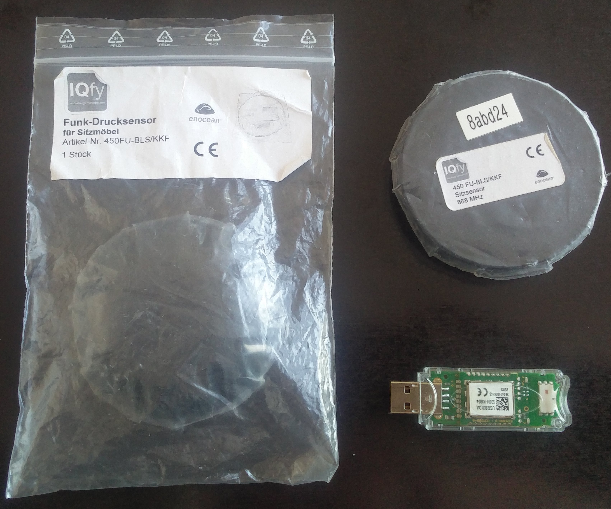
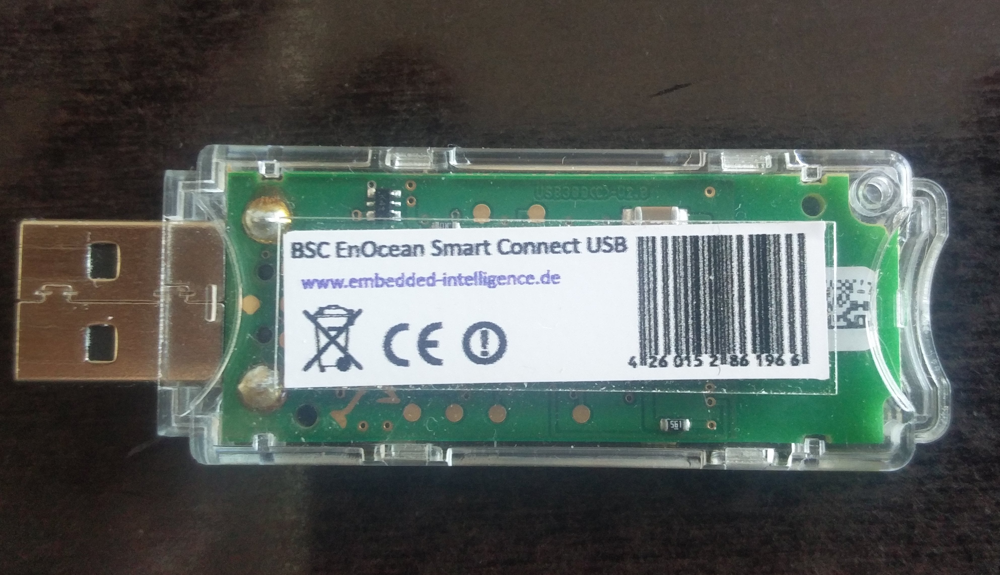
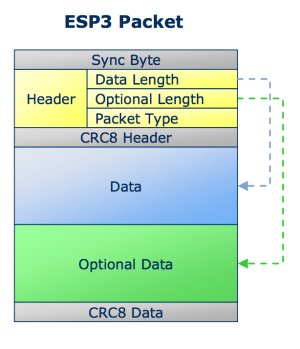

# Wireless & No batteries! IoT Button with EnOcean in Go (and/or ruby)

_Note: The EnOcean sensor & receiver combo might not be the the cheapest way of getting an IoT switch integrated but I was looking especially for a wireless solution and really liked the NO-batteries-needed-piezo-approach._

The wireless [sensor], a [receiver] and a little bit of go or ruby code is what it takes to bridge into the IoT world from the convenience of your laptop. Depending on your (or my) perspective you are either interested in the no-battery sensor setup or in how to use go to read and decode binary [EnOcean] [serial protocol] datagrams from a serial port.

[sensor]: <//www.iqfy.de/de/produkte/product/Drucksensor.html>
[receiver]: <//www.enocean.com/en/enocean_modules/usb-300-oem/>
[EnOcean]: <//www.enocean.com/en/>
[4]: <//www.enocean.com/esp>
[serial protocol]: <//www.enocean.com/esp>
[6]: <//github.com/artcom/gocean/blob/master/EnOceanSerialProtocol3.pdf>



<!--end-of-excerpt-->

I was looking for some small problem to solve in [go] and already had the [EnOcean] code ready in ruby. Go interests me because of its promise of good old single binary executable deployment. Sounds better than shipping source and dependencies in form of a self exploding deployment process down the `[homebrew & rvm &] ruby & bundler & gem [& capistrano]` and friends pipeline.

[go]: <//golang.org/project/>

## Usage, in case you don't care for the code

```bash
$ git clone https://github.com/artcom/gocean
$ cd gocean
$ go build
$ ./gocean.go -v -id 8abeea /dev/tty.usbserial-FTWN15UU  
start reading device now...
<8ffdea:down>
<8ffdea:up>
<81be24:down>
<81be24:up>
```

- Drop the `-v` option to make the program less verbose. 
- Drop the `-id <sensor id>` option to report all sensors. The sensor id option
  can be used multiple times to add more than one sensor id to the whitelist.
  When no id is given all received sensor packets are reported. 

## Hardware

### The Sender: IQfy Funk-Drucksensor 450FU-BLS/KKF

- <http://www.iqfy.de/de/produkte/product/Drucksensor.html>

The sensor is build to be sit on. Therefor it is very robust and easily able to stand your mechanical abuse. As far as I know it is used in cars to active this annoying warning sound in case you forgot to put your seat belt on. The electric energy to radio signal up and down states it generates from a piezo element inside which of course is driven by your booty force being used to active it. Instead of sitting on it, it equally well can be hold and pushed by hand.  

### The Receiver: BSC EnOcean Smart Connect USB Gateway

- <http://www.enocean.com/en/enocean_modules/usb-300-oem/>



There are lots of different solutions available to catch the sensor signal. As a programmer the one which comes as USB stick is the most accessible. Once plugged in and you are ready to receive the packets. 

## Go code

- <https://github.com/artcom/gocean>

_I'm still new to Go and on my way finding out how I like things to look like in an idomatic way. This said, I can confess I'm not happy with how it looks now. It works but I believe there are way more elegant idioms in go to code this._

First there is opening the serial device file. Nothing special here, device name is taken from command line, baud rate is an option but byte size and parity is not. The device is read in the `loopread` funcion which pushes it bytewise into the PacketParser. `PacketParser` decodes it along its state model of how such a binary protol packet has to look like. There are like start markers and checksum and type fields. The actual parsing phase is stored in `state_cb` and is one of: `waiting_for_sync, reading_header, reading_data, reading_opt_data` and `read_packet_checksum`.

When the packet is complete it checked for sensor type code is `0xF6` _(the only only this program understands)_ the packet is made into an `IQfyDruckSensor` struct from which its `state` and `sensor_id` gets printed to `stdout`. 

## Ruby Code

Found in its own _abandoned_ repo at: <https://github.com/artcom/enocean-ruby-reader>

## Next

For demonstration purpose I cross compiled this go code to a raspberry and made it toggle GPIO leds. From there you can connect it to whatever you want.
